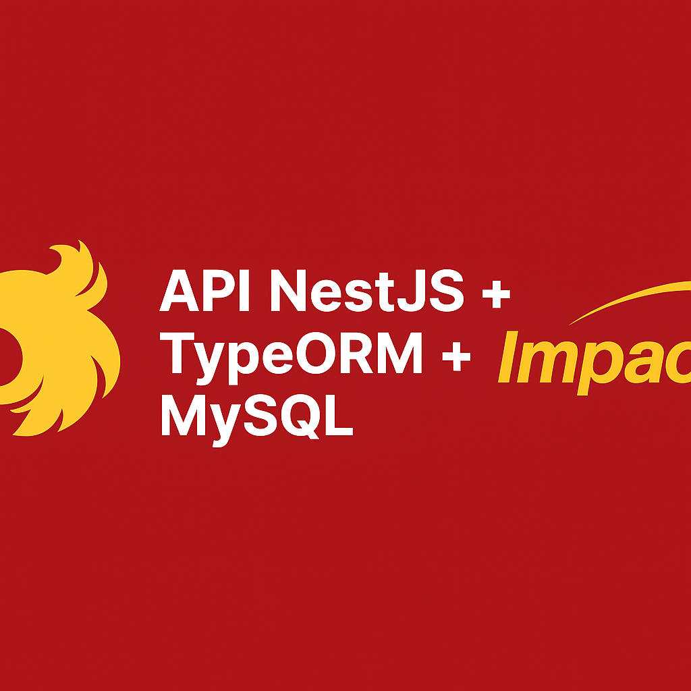

<p align="center">
  
</p>

# 🧠 API NestJS + TypeORM + MySQL - Impacta

API desenvolvida com **NestJS**, **TypeORM** e **MySQL**, aplicando boas práticas de arquitetura, autenticação e segurança.  
Projeto acadêmico da **Faculdade Impacta** — autoria **A2D-Dev (Anderson Dantas Dias)**.

---

## 🚀 Tecnologias e Ferramentas


---

## 📂 Estrutura de Pastas (sugerida)

📦 api-nest-impacta-typeorm
┣ 📂 src
┃ ┣ 📂 user
┃ ┣ 📂 auth
┃ ┣ 📂 database
┃ ┣ 📂 mailer
┃ ┣ 📂 common
┃ ┗ main.ts
┣ 📂 test
┣ .env.example
┣ package.json
┣ README.md
┗ tsconfig.json


---

## 📦 Instalação

```bash
git clone https://github.com/A2D-Dev/api-nest-impacta-typeorm.git
cd api-nest-impacta-typeorm
npm install

⚙️ Executando
# Desenvolvimento (hot-reload)
npm run start:dev


Aplicação em:
👉 http://localhost:3000

🌱 Variáveis de Ambiente

Crie um arquivo .env com base no .env.example:

DATABASE_HOST=localhost
DATABASE_PORT=3306
DATABASE_USER=root
DATABASE_PASS=123456
DATABASE_NAME=impacta_typeorm
JWT_SECRET=impacta2025
EMAIL_USER=seu_email@ethereal.email
EMAIL_PASS=sua_senha

🔐 Funcionalidades Implementadas

Autenticação com JWT (login, recuperação e redefinição de senha)

Controle de acesso (RBAC) com RoleGuard

Envio de e-mails (Nodemailer + Ethereal)

Uploads de arquivos (Multer)

Limite de requisições (Throttler) para segurança

Validação de dados com class-validator

Banco de dados relacional com TypeORM

🧩 Principais Scripts
Comando	Descrição
npm run start:dev	Inicia o servidor em modo desenvolvimento
npm run typeorm migration:run	Executa as migrations pendentes
npm run typeorm migration:generate -- name	Cria uma nova migration
npm run test	Executa os testes automatizados
🧠 Projeto Anterior (Base Prisma)

🔗 A2D-Dev/api-nest-impacta

Este projeto é a evolução direta do Milestone 5, agora migrando de Prisma para TypeORM.

🧾 Licença

Projeto sob MIT
.

👨‍💻 Autor

A2D-Dev (Anderson Dantas Dias)
GitHub: https://github.com/A2D-Dev